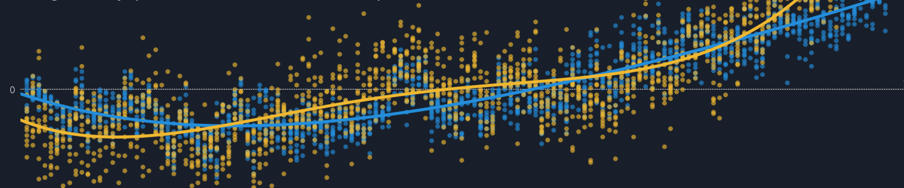

### Hi there 👋

## What I do 💻

  - Interested into science to business applications - I develop methods
    for quality solution, like the identification contaminants like
    bacteria, allergens in food based on genomic data.  
  - Academic research in plant domestication, cultural evolution.

## dataviz 🎨

  - [**Monday Make
    Over**](https://public.tableau.com/profile/vincent.manzanilla#!/)
  - [**TidyTuesday**](https://github.com/vincentmanz/TidyTuesday)

## Where to find me 🌍

  - [Tweeting](https://twitter.com/vincent_manz)
  - [updates on
    LinkedIn](https://nl.linkedin.com/in/vincent-manzanilla-98675028)

 

  

